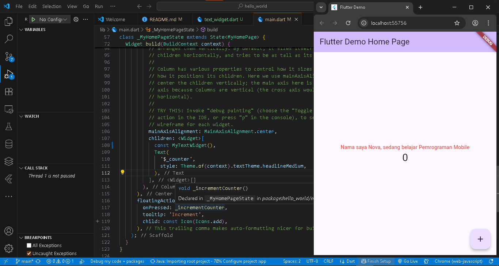
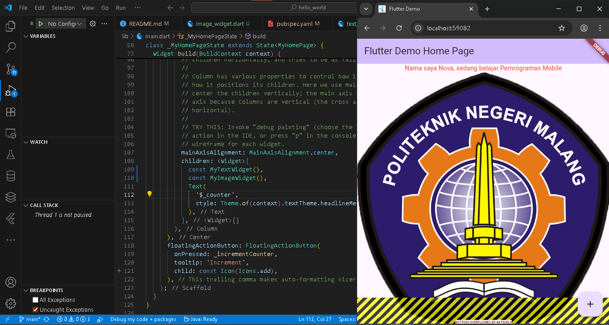
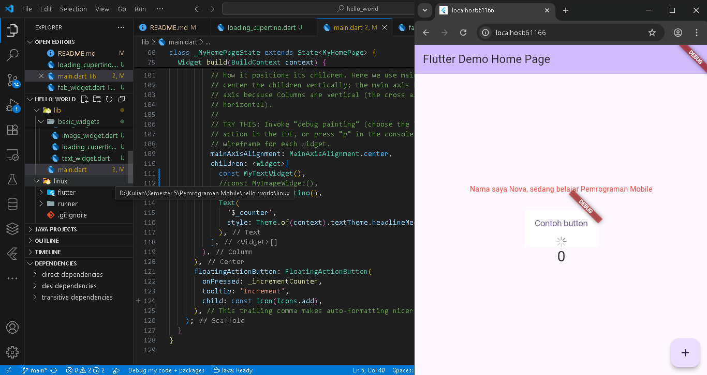
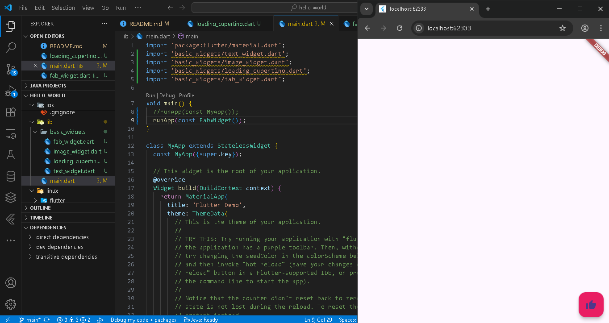
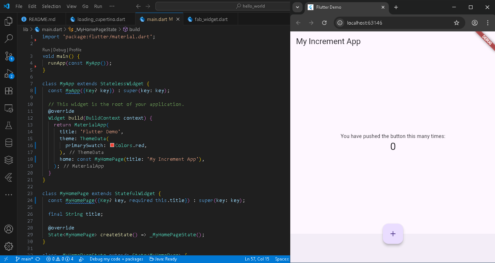
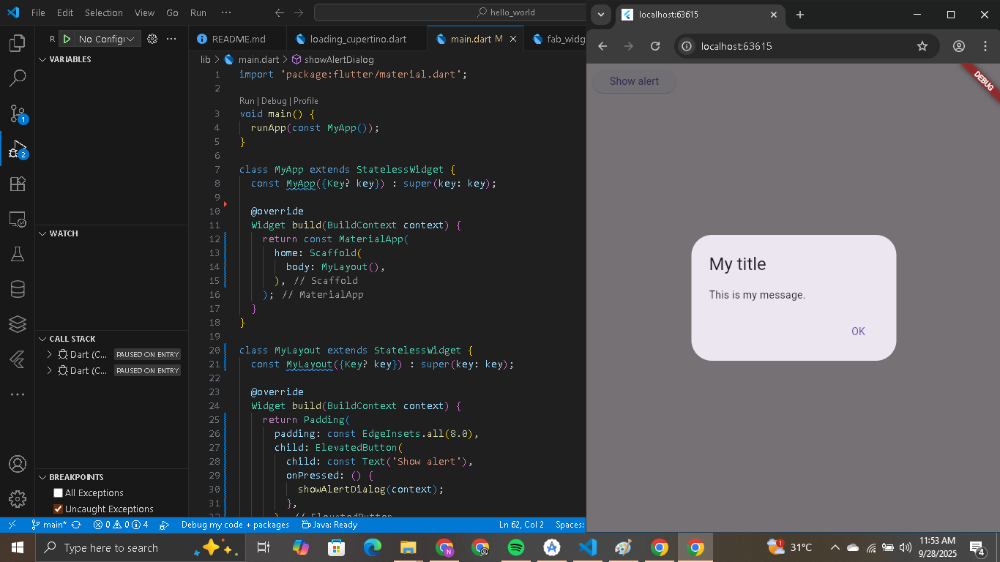
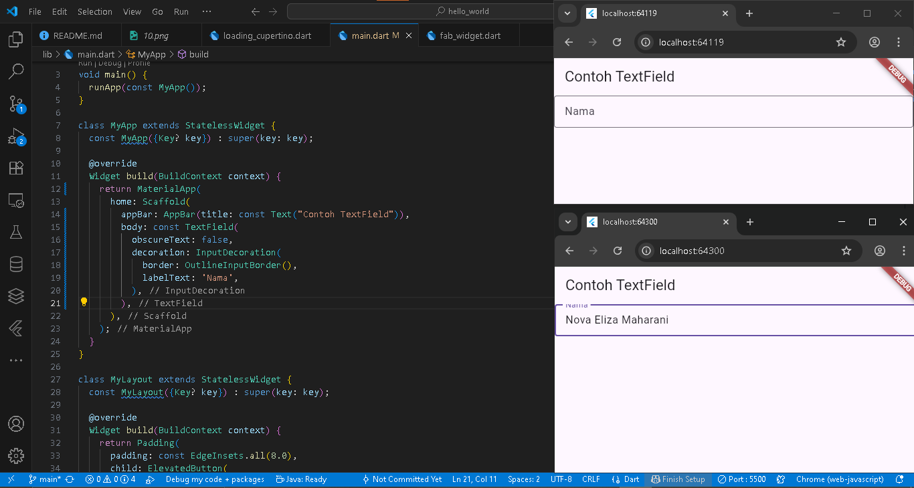
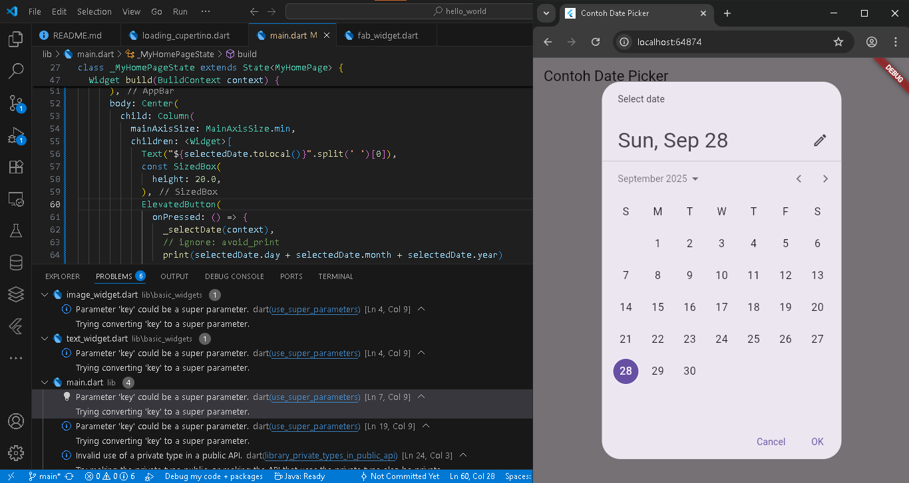

# hello_world

Nova Eliza Maharani
2341720252 / TI 3D - 24

### JOBSHEET PERTEMUAN 5

#### Praktikum 1
Membuat project hello_world

#### Praktikum 2
Tampilan pada PC

Tampilan pada HP 

#### Praktikum 3
Menjalankan Flutter

#### Praktikum 4
Text widget

Image widget

#### Praktikum 5

Loading cupertino

Fab widget

Scaffold widget

Dialog widget

Input dan selection widget

Date and time pickers
