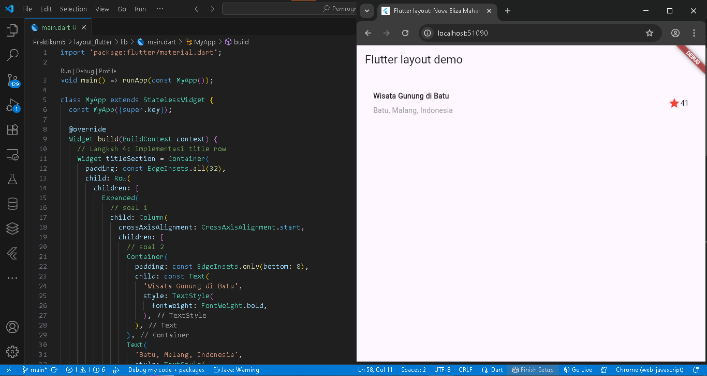
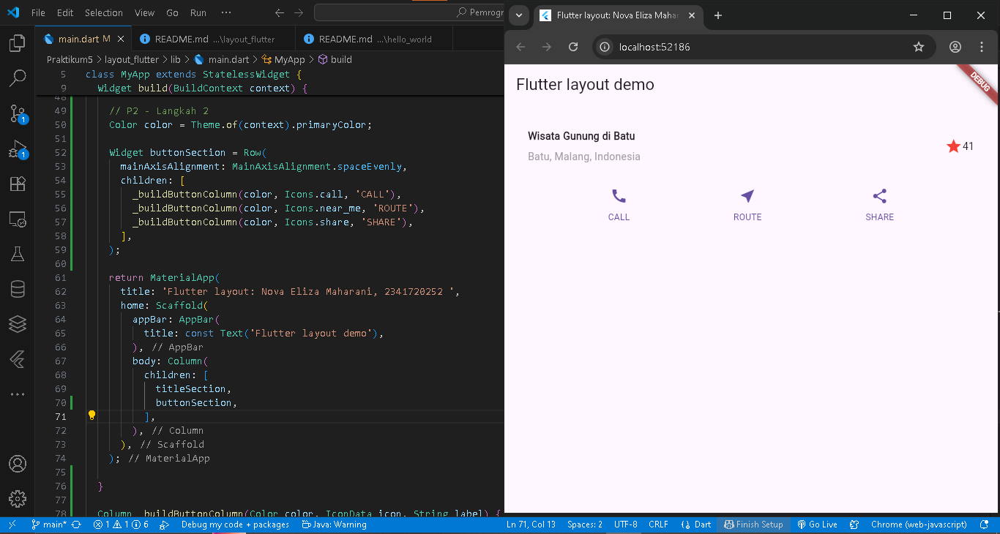
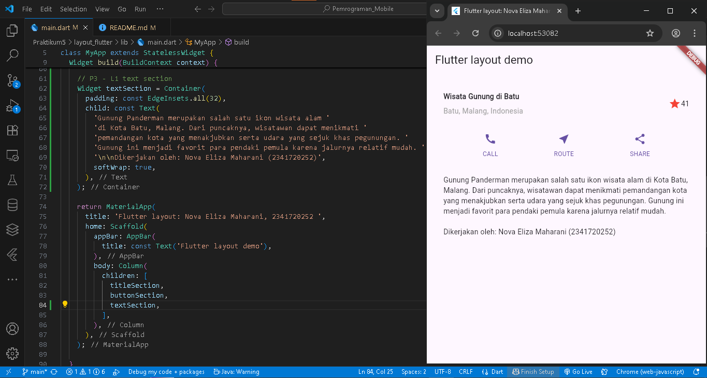
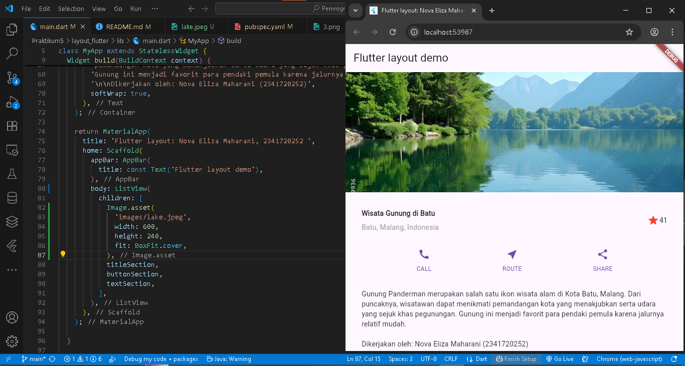
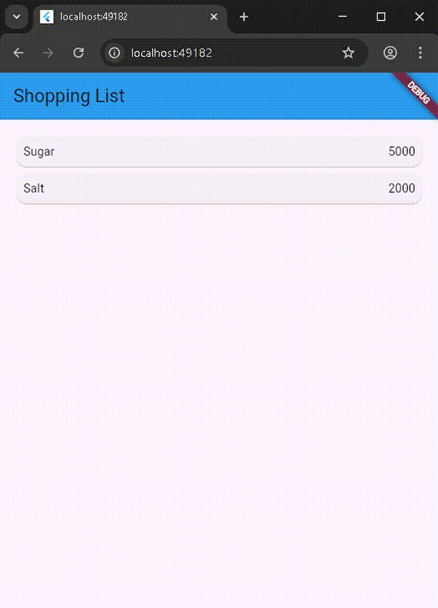
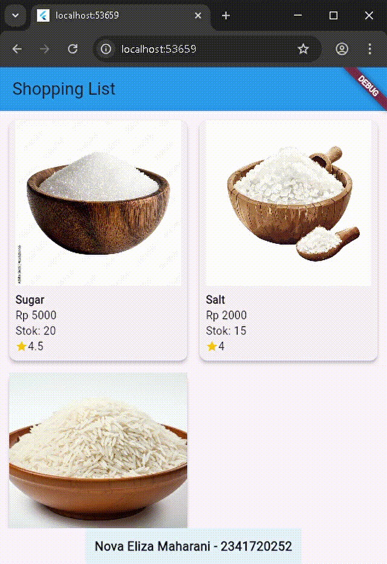

# belanja

Nova Eliza Maharani
2341720252 / TI 3D - 24

## JOBSHEET PERTEMUAN 6 

#### Praktikum 1
Implementasi title row.
Menampilkan judul, lokasi, dan rating tempat wisata menggunakan kombinasi Row dan Column.

#### Praktikum 2
Implementasi button row.
Menambahkan tiga tombol aksi (CALL, ROUTE, SHARE) yang tersusun rapi dalam satu baris.

#### Praktikum 3
Implementasi text section.
Menampilkan deskripsi tempat wisata beserta identitas pembuat dengan tampilan teks yang rapi.

#### Praktikum 4
Implementasi image section.
Menambahkan gambar utama di bagian atas untuk mempercantik dan memperjelas tampilan aplikasi.

#### Tugas 1
Hasil pengerjaan ada diatas

#### Praktikum 5
Membangun navigasi di flutter.
Video ini memperlihatkan cara membuat navigasi antarhalaman di Flutter menggunakan Navigator.pushNamed.

#### Tugas 2
Video ini menampilkan hasil penerapan navigasi dengan pengiriman data antarhalaman menggunakan arguments.

