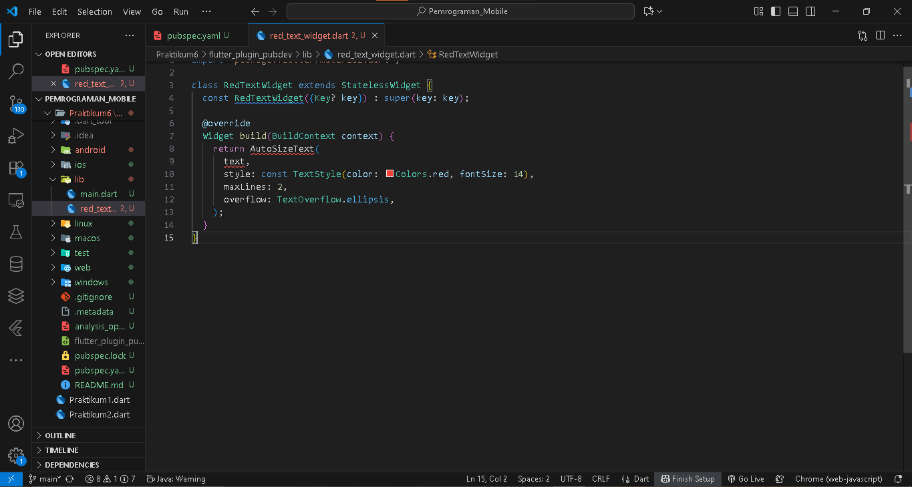
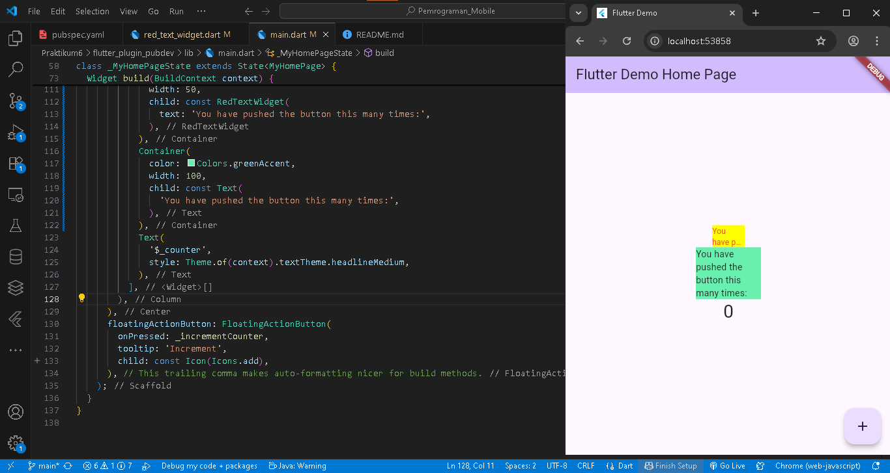

# flutter_plugin_pubdev

Nova Eliza Maharani
2341720252 / TI 3D - 24

## JOBSHEET 6

#### LANGKAH 4
Error muncul karena kode memanggil widget AutoSizeText dan variabel text tanpa deklarasi dan impor yang benar. Flutter juga tidak mengenali text karena belum ada variabel atau parameter dengan nama tersebut di dalam kelas

#### LANGKAH 6
Hasil Praktikum

## TUGAS PRAKTIKUM

#### Jelaskan maksud dari langkah 2 pada praktikum tersebut!
Jawab : Langkah 2 bertujuan untuk menambahkan package eksternal bernama auto_size_text ke dalam project Flutter agar dapat menggunakan widget AutoSizeText, yaitu widget yang secara otomatis menyesuaikan ukuran teks agar pas dengan batas area tampilannya.

#### Jelaskan maksud dari langkah 5 pada praktikum tersebut!
Jawab : Langkah 5 bertujuan untuk menambahkan variabel text sebagai properti dari kelas RedTextWidget agar widget dapat menerima teks dari luar melalui konstruktor. Dengan menambahkan parameter required this.text, setiap kali RedTextWidget dipanggil, pengguna wajib memberikan nilai teks yang akan ditampilkan oleh widget.

#### Pada langkah 6 terdapat dua widget yang ditambahkan, jelaskan fungsi dan perbedaannya!
Jawab : Fungsi kedua widget adalah untuk menampilkan teks, tetapi dengan cara yang berbeda. RedTextWidget menampilkan teks berwarna merah yang otomatis menyesuaikan ukuran menggunakan plugin auto_size_text, sedangkan Text hanya menampilkan teks biasa tanpa penyesuaian ukuran. Perbedaan ini menunjukkan keunggulan widget kustom dalam mengontrol tampilan teks secara lebih fleksibel.

#### Jelaskan maksud dari tiap parameter yang ada di dalam plugin auto_size_text berdasarkan tautan pada dokumentasi ini !
Jawab : Plugin auto_size_text menyediakan widget AutoSizeText yang berfungsi menampilkan teks dengan ukuran font yang otomatis menyesuaikan ruang yang tersedia agar tidak terpotong. Beberapa parameter utamanya yaitu text untuk isi teks, style untuk mengatur tampilan seperti warna dan ukuran awal font, minFontSize dan maxFontSize untuk menentukan batas minimum dan maksimum ukuran huruf, serta stepGranularity yang mengatur langkah penurunan ukuran font saat teks disesuaikan. Parameter maxLines membatasi jumlah baris teks, overflow menentukan perilaku jika teks tetap tidak muat (misalnya dipotong dengan elipsis), dan overflowReplacement menampilkan widget pengganti jika teks tidak bisa lagi dikecilkan. Dengan parameter-parameter ini, AutoSizeText memastikan teks tetap terbaca dengan rapi tanpa melebihi batas ruang tampilan.